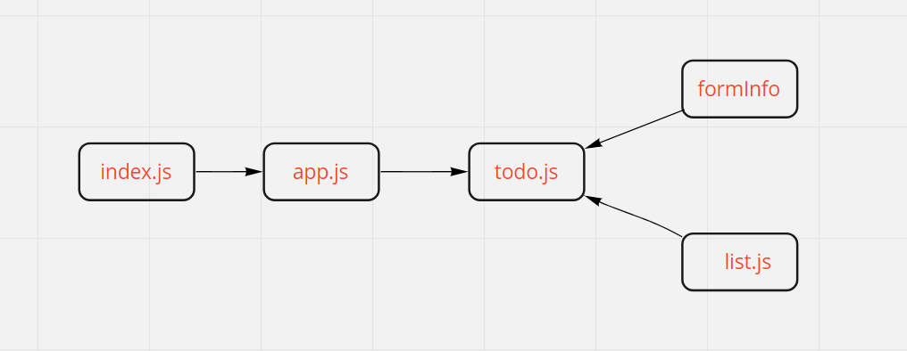

# todo-app
- [Netlify deploy](https://react-todo-app-sara.netlify.app/)
- [pull request context-settings](https://github.com/Saraaltaweel/todo-app/pull/6)
- [pull request context-methods](https://github.com/Saraaltaweel/todo-app/pull/7)
- [pull request auth](https://github.com/Saraaltaweel/todo-app/pull/8)
- [pull request auth lab34](https://github.com/Saraaltaweel/todo-app/pull/9)

